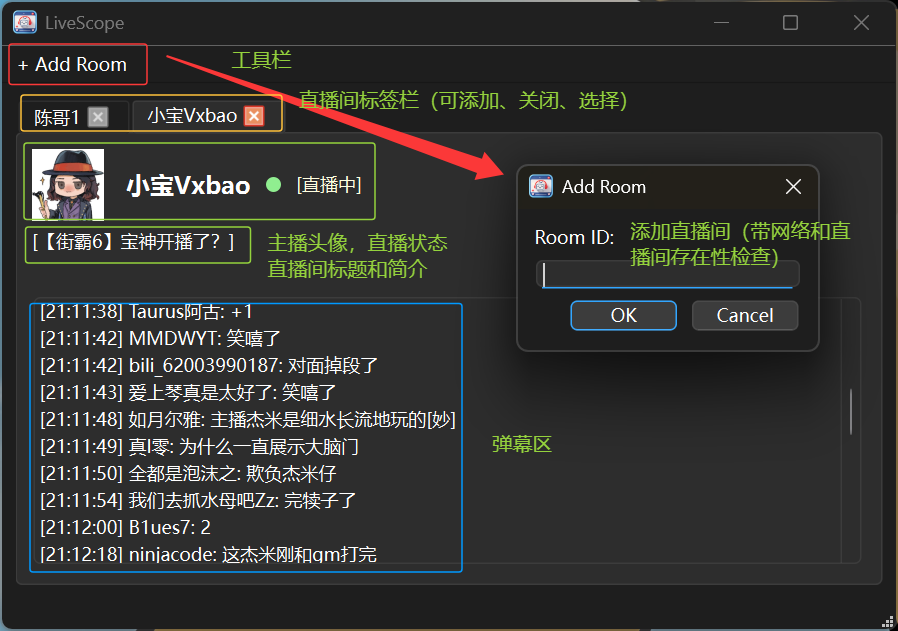

# LiveScope

基于 Qt/C++ 的多房间直播弹幕监控与数据分析桌面应用。  

## 版权声明  

仅供个人学习研究使用，**禁止未经许可商业使用**。  
无任何担保，所有使用风险由使用者自行承担。  
详见项目根目录 `COPYING` 文件。  

## 项目简介

LiveScope 是一个基于 C++ 和 Qt 开发的桌面应用，用于实时监控多个直播间的弹幕信息，并对弹幕数据进行持久化和分析。  

用户可以添加多个直播间，在不同标签页中分别查看直播弹幕，并支持将直播间窗口独立显示。  

项目后续将加入弹幕历史查询、数据统计、关键词分析以及词云等功能。  

## 技术栈  

- C++ / Qt 桌面应用开发
- HTTP 网络通信与 JSON 数据解析
- Qt 多线程与信号槽机制
- SQLite / MySQL 数据库设计与开发
- Qt Model/View
- 数据统计与可视化
- CMake 项目构建
- Windows / Linux 跨平台开发

## 当前状态

### demo  

项目目录中包含了一个可运行的demo，证明了此项目的可行性，直接在终端运行 demo 目录中的 `blivechat.py` 即可查看效果（指定直播间需要修改源文件内`room_id`）。  

### MVP（已实现 2026-08-12）  

目标是实现一个最小可用的直播弹幕监控系统。

#### 功能

- [x] 基础 UI 设计
- [x] 解析短房间号获取真实房间号  
- [x] 添加直播间  
- [x] HTTP 获取直播弹幕  
- [x] JSON 数据解析  
- [x] 实时显示弹幕  
- [x] 同时监控多个直播间  
- [x] 关闭直播间并停止数据获取  
- [x] 应用图标  
- [x] SC显示  
- [x] 网络状态和房间检测

  

#### 更新  

2026-08-13:  

- 现在点击主播昵称和直播间标题可以跳转到个人空间和直播间了！可跳转的文字做了加粗处理  
- 现在会自动打开新建的标签页了
- 现在列表聚焦在新的弹幕了
- ui bug 修复，`room id` 与 `uid` 获取失败bug修复  

## 计划进行

- [ ] 历史房间保存
- [ ] SQLite / MySQL 数据持久化
- [ ] 历史弹幕查询
- [ ] 数据统计
- [ ] 词云
- [ ] tab 页独立窗口

